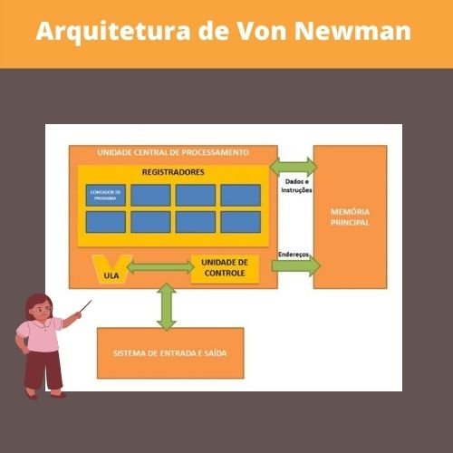
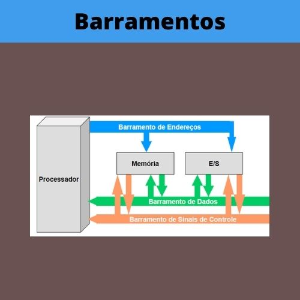

# Capítulo 2 – Conceitos Básicos da Área de Computação

### Disciplina: Fundamentos de Computação  
Curso: Ciência da Computação  
Professor: Nelcileno Araújo  

## Introdução

Neste capítulo são apresentados os **conceitos básicos da área de Computação**, fundamentais para compreender como os sistemas computacionais funcionam, desde seus componentes físicos até a execução de programas.

Ao final do capítulo, é proposta a **Atividade Formativa 1 – Conceitos Básicos da Área de Computação**, na forma de um quiz para avaliar o entendimento dos conteúdos estudados.

## Componentes de um Sistema Computacional

Um computador é composto por **hardware** e **software**, que trabalham de forma integrada para receber, processar, armazenar e transmitir informações.

### Exemplo de componentes físicos (hardware)

### Exemplo de softwares

## Arquitetura de Von Neumann

A Arquitetura de Von Neumann é um modelo clássico de organização de computadores, no qual **dados e instruções são armazenados na mesma memória**.

### Componentes principais
- Unidade Central de Processamento (CPU)
- Memória Principal
- Dispositivos de Entrada e Saída
- Barramentos

## Barramentos

Os barramentos são responsáveis pela comunicação entre os componentes do computador.

### Tipos de barramentos
- **Barramento de Dados**: transporta dados entre os componentes;
- **Barramento de Endereços**: identifica posições de memória;
- **Barramento de Controle**: transporta sinais de controle e sincronização.

## Glossário

### Computador
Máquina constituída por um conjunto de componentes e circuitos eletrônicos, capaz de receber, armazenar, processar e transmitir informações.

### Hardware
Parte física do computador, composta por componentes eletrônicos e dispositivos físicos.

### Software
Programa de computador composto por uma sequência de instruções interpretadas e executadas por um processador ou máquina virtual, resultando em um comportamento desejado.

### CPU (Processador)
Responsável pelo processamento de todos os tipos de dados e pela apresentação dos resultados.

### Unidade Lógica Aritmética (ULA)
Circuito responsável por realizar operações matemáticas e lógicas requisitadas por um programa.

### Unidade de Controle
Responsável por controlar o fluxo de dados e interpretar cada instrução do programa.

### Registradores
Elementos digitais localizados no processador, com capacidade de armazenar dados temporariamente.

### Memória Principal
Memória básica do sistema computacional onde ficam armazenados os programas e os dados que serão executados pelo processador.

### Dados
Conjunto de registros organizados que possibilitam a produção de informações.

### Instrução
Comando fornecido ao processador para executar uma tarefa específica, como soma, teste ou desvio.

### Endereço de Memória
Identificador único de um local da memória onde dados ou instruções podem ser armazenados.

### Dispositivos de Entrada
Dispositivos que permitem a entrada de dados no computador.  
Exemplos: teclado, mouse, microfone.

### Dispositivos de Saída
Dispositivos que exibem informações processadas pelo computador.  
Exemplos: monitor, impressora, caixas de som.

### Dispositivos de Entrada e Saída
Dispositivos que enviam e recebem informações do computador.  
Exemplos: disco rígido, placa de rede, monitor touchscreen.

### Barramentos
Conjunto de linhas de comunicação responsáveis pela interligação entre CPU, memória e periféricos, permitindo a transmissão de dados, endereços e sinais de controle.
