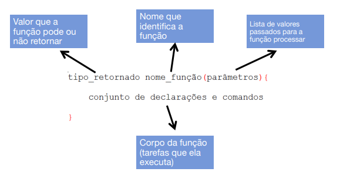
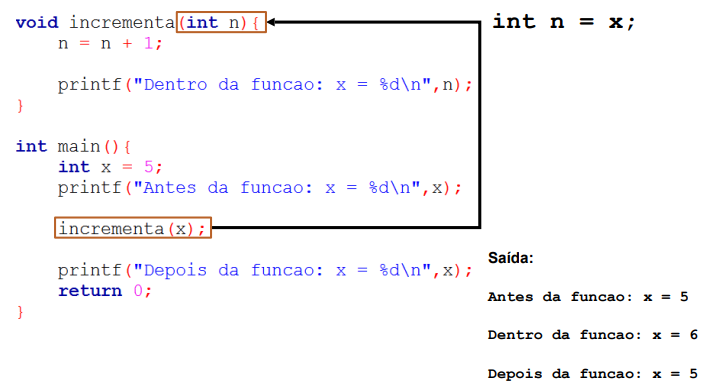

# Funções/Modularização

**O que é uma função?**

A função tem o objetivo de ser especialista em uma coisa. Funções são blocos de código que podem ser nomeados e chamados de dentro de um programa.

- Facilitam a estruturação e reutilização do código.
  • Estruturação: programas grandes e complexos são construídos bloco a bloco.
  • Reutilização: o uso de funções evita a cópia desnecessária de trechos de código que realizam a mesma tarefa, diminuindo assim o tamanho do programa e a ocorrência de erros.

Quem chama a função main é o sistema operacional

Quando uma função não retorna nada chamamos de **procedimento**

## Estrutura de uma função

**Parâmetros da função:**
A declaração de parâmetros é uma lista de variáveis juntamente com seus tipos:

- tipo1 nome1, tipo2 nome2
- Pode-se definir quantos parâmetros achar necessário
  '''
  int soma(int x, int y){
  return x + y;
  }
  '''
  As funções que não recebem parâmetros são chamadas de procedimento que podem ser feitos de duas formas:
- Podemos deixar a lista de parâmetros vazia
- Podemos usar a palavra chave void
  '''
  void mensagem(){
  printf("Olá, mundo!");
  }
  '''
  '''
  void mensagem(void){
  printf("Olá, mundo!");
  }
  '''
  'A função deve ser declarada antes da clausula **main**'

## Variável Global

Variáveis globais são declaradas fora de todas as funções do programa.

- Elas são conhecidas e podem ser alteradas por todas as funções do programa.
- Quando uma função tem uma variável local com o mesmo nome de uma variável global a função dará preferência à variável local.
- **Evite variáveis globais!**

## Variável Local

Variáveis locais são aquelas que só têm validade dentro do bloco no qual são declaradas.
• Um bloco começa quando abrimos uma chave e termina quando fechamos a chave.

## Passagem de Parâmetros

Na linguagem C, os parâmetros de uma função são sempre passados por valor, ou seja, **uma cópia do valor do parâmetro é feita e passada para a função.**
• Mesmo que esse valor mude dentro da função, nada acontece com o valor de fora da função.

## Passagem por Valor

## Passagem por Referência

Quando se quer que o valor da variável mude dentro da função, usa-se passagem de parâmetros por referência.
• Neste tipo de chamada, não se passa para a função o valor da variável, mas a sua referência (seu endereço na memória);

