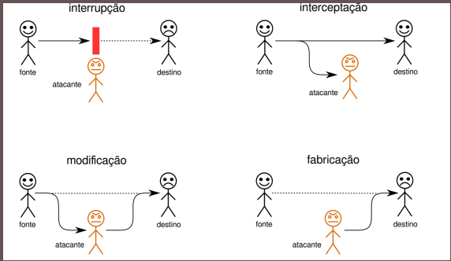

# Princípios Gerais de Segurança da Informação
### Disciplina: Segurança de Redes e Internet 
Material feito pelo Prof Nelcileno Araujo

## Propriedades 

### 1. Confidencialidade 
Os recursos presentes no sistema só podem ser consultados por usuários devidamente autorizados a isso;
### 2. Integridade
Os recursos do sistema só podem ser modificados ou destruídos pelos usuários autorizados a efetuar tais operações
### 3. Disponibilidade 
Os recursos devem estar disponíveis para os usuários que tiverem direito de usá-los, a qualquer momento.
### 4. Autenticidade
Todas as entidades do sistema são autênticas ou genuínas; em outras palavras, os dados associados a essas entidades são verdadeiros e correspondem às informações do mundo real que elas representam, como as identidades dos usuários, a origem dos dados de um arquivo, etc.;
### 5. Irretratabilidade
Todas as ações realizadas no sistema são conhecidas e não podem ser escondidas ou negadas por seus autores; esta propriedade também é conhecida como irrefutabilidade ou não-repúdio.

## Princípios
### 1. Privilégio Mínimo 
Todos os usuários e programas devem operar com o mínimo possível de privilégios ou permissões de acesso necessários para poder funcionar.
### 2. Separação de privilégios
Sistemas de proteção baseados em mais de um controle ou regra são mais robustos, pois se o atacante conseguir burlar um dos controles, mesmo assim não terá acesso ao recurso.
### 3. Mediação Completa
Todos os acessos a recursos, tanto diretos quanto indiretos, devem ser verificados pelos mecanismos de segurança.
### 4. Default Seguro
O mecanismo de segurança deve identificar claramente os acessos permitidos; caso um certo acesso não seja explicitamente permitido, ele deve ser negado.

### 5. Economia de Mecanismo
O projeto de um sistema de proteção deve ser pequeno e simples, para que possa ser facilmente analisado, testado e validado.

### 6. Compartilhamento Mínimo
O uso de mecanismos compartilhados entre usuários deve ser minimizado, pois pode gerar fluxos de informação não previstos.

### 7. Proteção Adequada
Cada recurso computacional deve ter um nível de proteção coerente com seu valor e importância.

### 8. Facilidade de Uso
Os mecanismos de segurança devem ser fáceis e intuitivos, caso contrário serão evitados pelos usuários.

### 9. Eficiência
Os mecanismos de segurança devem utilizar os recursos computacionais de forma eficiente, sem impactar significativamente o desempenho do sistema.

### 10. Elo Mais Fraco
A segurança do sistema é limitada pela segurança de seu componente mais vulnerável, seja ele o sistema, a rede, a aplicação ou o próprio usuário.

## Ameaças

### 1. Ameaças à Confidencialidade
Visam obter acesso não autorizado a informações sensíveis, como senhas, dados bancários e informações pessoais.

### 2. Ameaças à Integridade
Buscam alterar dados ou configurações do sistema sem autorização.

### 3. Ameaças à Disponibilidade
Tentam impedir que usuários legítimos tenham acesso aos recursos do sistema.

## Vulnerabilidades
São falhas ou erros que podem ser explorados por atacantes, como:
- Erros de programação;
- Contas sem senha ou com senha padrão;
- Ausência de controle de uso de recursos.

## Ataques
- Interrupção  
- Interceptação  
- Modificação  
- Fabricação  

## Malwares
- Vírus  
- Worm  
- Trojan Horse  
- Exploit  
- Packet Sniffer  
- Keylogger  
- Rootkit  
- Backdoor  
- Ransomware  

## Infraestrutura de Segurança
Conjunto de mecanismos responsáveis por autenticação, controle de acesso, auditoria e aplicação de políticas de segurança em sistemas computacionais.

